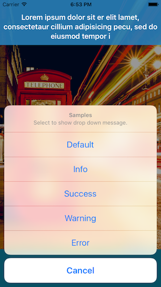
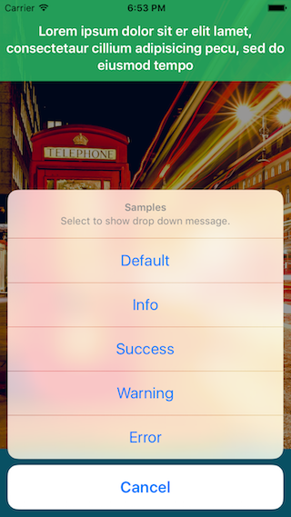
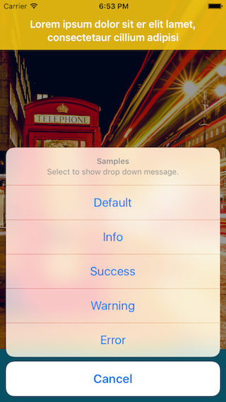
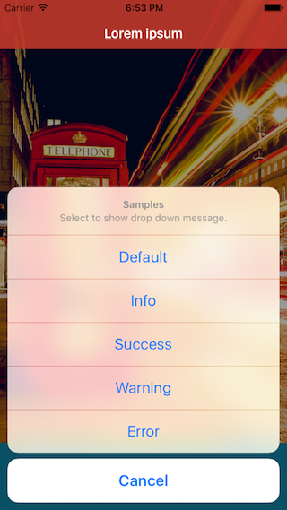
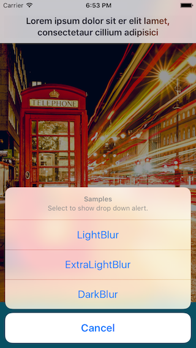
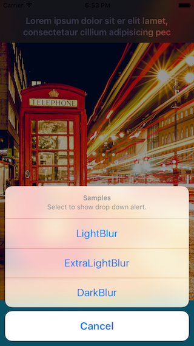
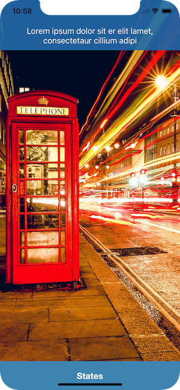
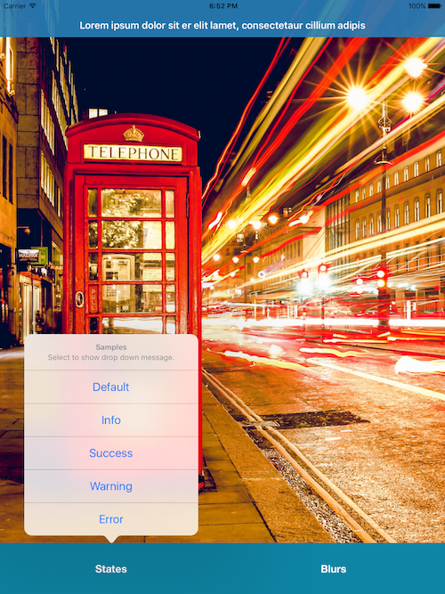

# SwiftyDrop

SwiftyDrop is a lightweight pure Swift simple and beautiful dropdown message.

[](http://cocoadocs.org/docsets/SwiftyDrop) [](http://cocoadocs.org/docsets/SwiftyDrop) [](http://cocoadocs.org/docsets/SwiftyDrop)
[](https://github.com/Carthage/Carthage)
[](https://gitter.im/morizotter/SwiftyDrop?utm_source=badge&utm_medium=badge&utm_campaign=pr-badge&utm_content=badge)

## Features

- Easy to use like: `Drop.down("Message")`
- Message field expands depending on the message.

## How it looks

### States





### Blurs



### iPhone X



### iPad



## Demo

Git clone or download this repository and open  **SwiftyDrop.xcodeproj** . You can try SwiftyDrop in your Mac or iPhone.

## Runtime Requirements

- iOS8.0 or later
- Xcode 9.0
- Swift 4.0

## Installation and Setup

**Note:** Embedded frameworks require a minimum deployment target of iOS 8.1.

**Information:** To use SwiftyDrop with a project targeting iOS 8.0 or lower, you must include the `SwiftyDrop/Drop.swift` source file directly in your project.

### Installing with CocoaPods

[CocoaPods](http://cocoapods.org) is a centralised dependency manager that automates the process of adding libraries to your Cocoa application. You can install it with the following command:

```bash
$ gem update
$ gem install cocoapods
$ pods --version
```

To integrate SwiftyDrop into your Xcode project using CocoaPods, specify it in your `Podfile` and run `pod install`.

```bash
platform :ios, '8.0'
use_frameworks!
pod 'SwiftyDrop', '~>4.0'
```

### Installing with Carthage

Just add to your Cartfile:

```ogdl
github "morizotter/SwiftyDrop" ~> 4.0
```

### Manual Installation

To install SwiftyDrop without a dependency manager, please add all of the files in `/SwiftyDrop` to your Xcode Project.

## Usage

### Basic

To start using SwiftyDrop, write the following line wherever you want to show dropdown message:

```swift
import SwiftyDrop
```

Then invoke SwiftyDrop, by calling:

```swift
Drop.down("Message")
```

It is really simple!

### States

SwiftyDrop has states of display.

**Examples**

```swift
Drop.down("Message")
Drop.down("Message", state: .Success)
Drop.down("Message", state: .Color(.orangeColor()))
Drop.down("Message", state: .Blur(.Light))
```

**Custom states**

You can customize looks by comforming `DropStatable` protocol.
Examples are:

```swift
enum Custom: DropStatable {
    case BlackGreen
    var backgroundColor: UIColor? {
        switch self {
        case .BlackGreen: return .blackColor()
        }
    }
    var font: UIFont? {
        switch self {
        case .BlackGreen: return UIFont(name: "HelveticaNeue-Light", size: 24.0)
        }
    }
    var textColor: UIColor? {
        switch self {
            case .BlackGreen: return .greenColor()
        }
    }
    var blurEffect: UIBlurEffect? {
        switch self {
        case .BlackGreen: return nil
        }
    }
}

Drop.down(self.sampleText(), state: Custom.BlackGreen)
```

Of course you can use class or struct to make custom state if it is comforming to `DropStatable` protocol.

**Prepared States** are enum:
- .Default
- .Info
- .Success
- .Warning
- .Error
- .Color: UIColor
- .Blur: UIBlurEffectStyle

### Duration

```swift
Drop.down("Message", duration: 3.0)
```

You can change duration like this above. Default duration is 4.0.

### Action

```swift
Drop.down("Message") {
    print("Action fired!")
}
```

## Contribution

Please file issues or submit pull requests! We're waiting! :)

## License

SwiftyDrop is released under the MIT license. Go read the LICENSE file for more information.
